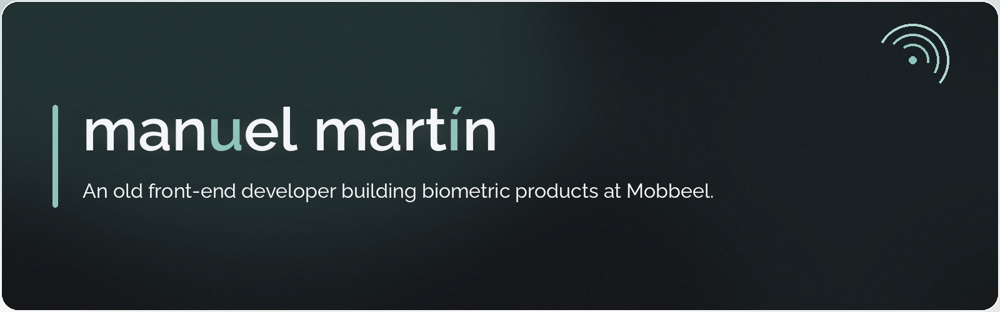
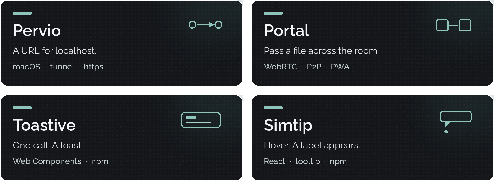

[Website](https://manuelmartin.dev) · [Lab](https://manuelmartin.dev/lab) · [Projects](https://manuelmartin.dev/projects) · [LinkedIn](https://www.linkedin.com/in/manuel-martin-developer/) · [Email](mailto:hola@manuelmartin.dev)

TypeScript and Web Components, with a bias for the platform. Biometric products at [Mobbeel](https://www.mobbeel.com).

### Work

[Pervio](https://manuelmartin.dev/projects/pervio) · [Portal](https://manuelmartin.dev/projects/portal) · [Toastive](https://manuelmartin.dev/projects/toastive) · [Simtip](https://manuelmartin.dev/projects/react-simtip)

### Lab

[Face landmark](https://manuelmartin.dev/lab/face-landmark) · [Eye dropper](https://manuelmartin.dev/lab/eye-dropper) · [View transition](https://manuelmartin.dev/lab/view-transition) · [Translator](https://manuelmartin.dev/lab/translator)  
[Offscreen canvas](https://manuelmartin.dev/lab/offscreen-canvas) · [Web audio](https://manuelmartin.dev/lab/web-audio-visualizer) · [All labs](https://manuelmartin.dev/lab)

TypeScript · Web Components · CSS · Vite · React
